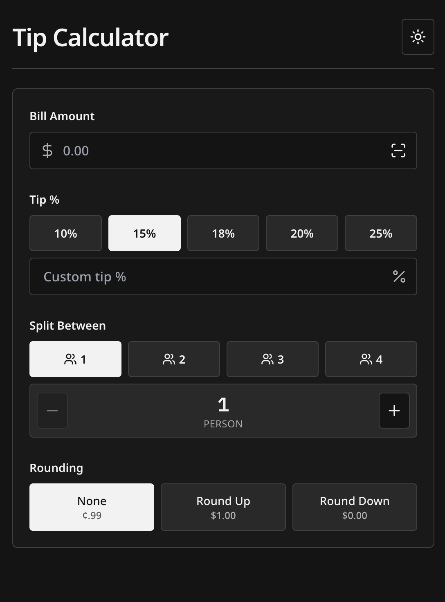

# Tip Calculator



A polished tip calculator built with Next.js 15. Quickly calculate tips, split bills, apply rounding, and scan receipts with OCR.

## Features

- Preset tip buttons (10/15/18/20/25) plus custom tip percentages
- Bill splitting with live per-person totals
- Rounding modes: none, round up, or round down
- Receipt scanner with client-side OCR (camera or upload)
- Locale-aware amount parsing for US and EU number formats

## Tech Stack

- Next.js 15 (App Router) + React 19
- TypeScript + Tailwind CSS
- Framer Motion + Lucide React
- Tesseract.js for OCR

## Quick Start

```bash
npm install
npm run dev
```

Open `http://localhost:3000`.

## Scripts

```bash
npm run dev    # Start development server (Turbopack)
npm run test   # Run unit tests
npm run lint   # Run ESLint checks
npm run build  # Create production build (TypeScript gate)
npm run start  # Start production server
```

## Project Structure

```text
app/                         # App Router pages and layout
components/tip-calculator.tsx
components/receipt-scanner.tsx
lib/number-utils.ts          # OCR amount parsing helpers
tests/number-utils.test.ts
public/manifest.json
```

## License

MIT
